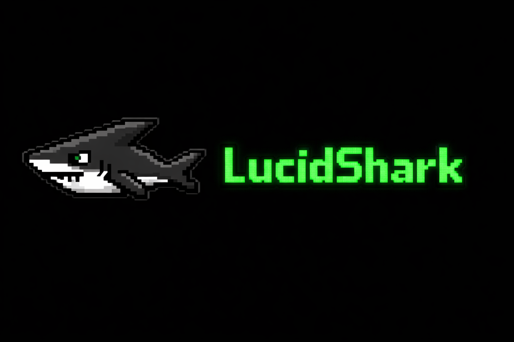

# LucidShark

<p align="center">
  
</p>

[](https://github.com/toniantunovi/lucidshark/actions/workflows/ci.yml)
[](https://codecov.io/gh/toniantunovi/lucidshark)
[](https://pypi.org/project/lucidshark/)
[](https://pypi.org/project/lucidshark/)
[](https://github.com/toniantunovi/lucidshark/blob/main/LICENSE)

**Unified code quality pipeline for AI-assisted development.**

```
AI writes code → LucidShark checks → AI fixes → repeat
```

## Why LucidShark

- **Local-first** - No server, no SaaS account. Runs on your machine and in CI with the same results.

- **Configuration-as-code** - `lucidshark.yml` lives in your repo. Same rules for everyone, changes go through code review.

- **AI-native** - MCP integration with Claude Code. Structured feedback that AI agents can act on directly.

- **Unified pipeline** - Linting, type checking, security (SAST/SCA/IaC), tests, coverage, and duplication detection in one tool. Stop configuring 5+ separate tools.

- **Open source & extensible** - Apache 2.0 licensed. Add your own tools via the plugin system.

## Quick Start

```bash
# 1. Install LucidShark (choose one)

# Option A: pip (requires Python 3.10+)
pip install lucidshark

# Option B: Standalone binary (no Python required)
# Linux/macOS:
curl -fsSL https://raw.githubusercontent.com/toniantunovi/lucidshark/main/install.sh | bash
# Windows (PowerShell):
irm https://raw.githubusercontent.com/toniantunovi/lucidshark/main/install.ps1 | iex

# 2. Set up Claude Code
lucidshark init

# 3. Restart your AI tool, then ask it:
#    "Autoconfigure LucidShark for this project"
```

That's it! Your AI assistant will analyze your codebase, ask you a few questions, and generate the `lucidshark.yml` configuration.

### Installation Options

| Method | Command | Notes |
|--------|---------|-------|
| **pip** | `pip install lucidshark` | Requires Python 3.10+ |
| **Binary (Linux/macOS)** | `curl -fsSL .../install.sh \| bash` | No Python required |
| **Binary (Windows)** | `irm .../install.ps1 \| iex` | No Python required |
| **Manual** | Download from [Releases](https://github.com/toniantunovi/lucidshark/releases) | Pre-built binaries |

The install scripts will prompt you to choose:
- **Global install** (`~/.local/bin` or `%LOCALAPPDATA%\Programs\lucidshark`) - available system-wide
- **Project-local install** (current directory) - project-specific, keeps the binary in your project root

### Running Scans

```bash
lucidshark scan --all               # Run all quality checks
lucidshark scan --linting           # Run specific domains
lucidshark scan --linting --fix     # Auto-fix linting issues
lucidshark scan --all --dry-run     # Preview what would be scanned
```

Scan domains: `--linting`, `--type-checking`, `--sast`, `--sca`, `--iac`, `--container`, `--testing`, `--coverage`, `--duplication`

### Example Output

When issues are found:

```
$ lucidshark scan --linting --type-checking --sast
Total issues: 4

By severity:
  HIGH: 1
  MEDIUM: 2
  LOW: 1

By scanner domain:
  LINTING: 2
  TYPE_CHECKING: 1
  SAST: 1

Scan duration: 1243ms
```

When everything passes:

```
$ lucidshark scan --all
No issues found.
```

Use `--format table` for a detailed per-issue breakdown, or `--format json` for machine-readable output.

### Diagnostics

Check your LucidShark setup with the doctor command:

```bash
lucidshark doctor
```

This checks:
- Configuration file presence and validity
- Tool availability (security scanners, linters, type checkers)
- Python environment compatibility
- Git repository status
- MCP integration (Claude Code)

### AI Tool Setup

```bash
lucidshark init    # Configure Claude Code (.mcp.json + .claude/CLAUDE.md)
```

Restart your AI tool after running `init` to activate.

## Supported Languages

LucidShark supports 15 programming languages with varying levels of tool coverage:

| Tier | Languages | What's Included |
|------|-----------|-----------------|
| **Full** | Python, TypeScript, JavaScript, Java, Rust | Linting, type checking, testing, coverage, security, duplication |
| **Partial** | Kotlin | Testing, coverage, security (via shared Java tooling) |
| **Basic** | Go, Ruby, C, C++, C# | Security scanning, duplication detection |
| **Minimal** | PHP, Swift, Scala | Security scanning |

For detailed per-language tool coverage, configuration examples, and detection info, see the [Language Reference](docs/languages/README.md).

## What It Checks

| Domain | Tools | What It Catches |
|--------|-------|-----------------|
| **Linting** | Ruff, ESLint, Biome, Checkstyle, Clippy | Style issues, code smells |
| **Type Checking** | mypy, Pyright, TypeScript (tsc), SpotBugs, cargo check | Type errors, static analysis bugs |
| **Security (SAST)** | OpenGrep | Code vulnerabilities |
| **Security (SCA)** | Trivy | Dependency vulnerabilities |
| **Security (IaC)** | Checkov | Infrastructure misconfigurations |
| **Security (Container)** | Trivy | Container image vulnerabilities |
| **Testing** | pytest, Jest, Karma (Angular), Playwright (E2E), Maven/Gradle (JUnit), cargo test | Test failures |
| **Coverage** | coverage.py, Istanbul, JaCoCo, Tarpaulin | Coverage gaps |
| **Duplication** | Duplo | Code clones, duplicate blocks |

All results are normalized to a common format.

## Configuration

LucidShark auto-detects your project. For custom settings, create `lucidshark.yml`:

```yaml
version: 1
pipeline:
  linting:  { enabled: true, tools: [{ name: ruff }] }
  type_checking:  { enabled: true, tools: [{ name: mypy, strict: true }] }
  security: { enabled: true, tools: [{ name: trivy }, { name: opengrep }] }
  testing:
    enabled: true
    command: "make test"            # Optional: custom command overrides plugin-based runner
    post_command: "make clean"      # Optional: runs after tests complete
    tools: [{ name: pytest }]
  coverage: { enabled: true, threshold: 80 }
  duplication: { enabled: true, threshold: 10.0 }
fail_on:
  linting: error
  security: high
  testing: any
ignore_issues:
  - rule_id: CVE-2021-3807
    reason: "Not exploitable in our context"
    expires: 2026-06-01
exclude: ["**/node_modules/**", "**/.venv/**"]
```

See [docs/help.md](docs/help.md) for the full configuration reference.

## CLI Reference

| Command | Description |
|---------|-------------|
| `lucidshark scan --all` | Run all quality checks |
| `lucidshark scan --linting --fix` | Lint and auto-fix |
| `lucidshark init` | Configure Claude Code integration |
| `lucidshark doctor` | Check setup and environment health |
| `lucidshark validate` | Validate `lucidshark.yml` |

For the full CLI reference, all scan flags, output formats, and exit codes, see [docs/help.md](docs/help.md).

## Development

```bash
git clone https://github.com/toniantunovi/lucidshark.git
cd lucidshark
pip install -e ".[dev]"
pytest tests/
```

## Documentation

- [Supported Languages](docs/languages/README.md) - Per-language tool coverage, detection, and configuration
- [LLM Reference Documentation](docs/help.md) - For AI agents and detailed reference
- [Exclude Patterns & Issue Ignoring](docs/exclude-patterns.md) - File exclusions, per-domain excludes, and ignoring specific issues
- [Full Specification](docs/main.md)

## License

Apache 2.0
