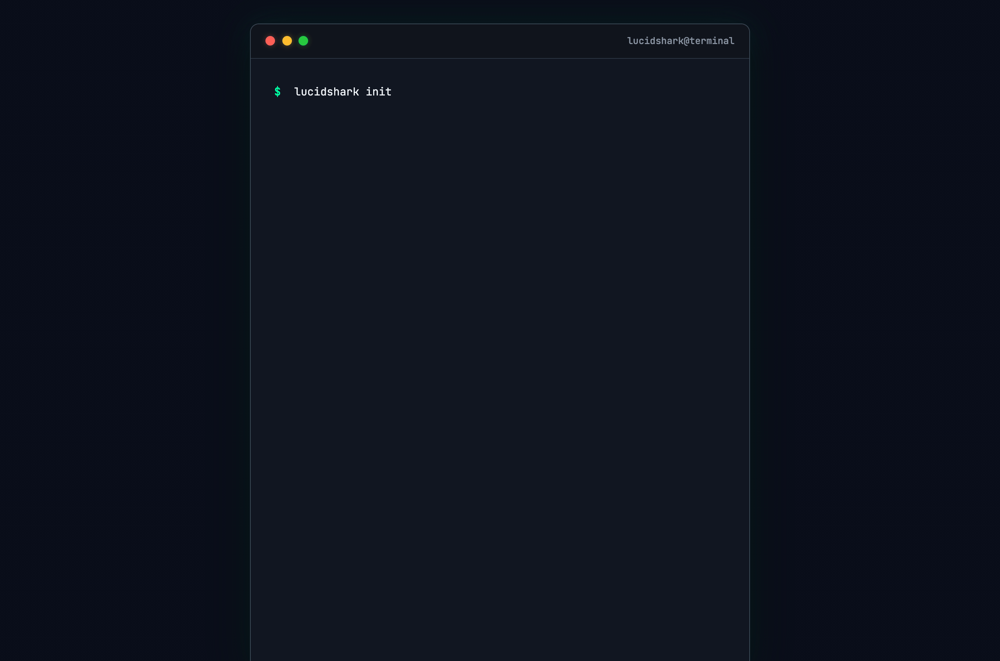

## LucidShark

[](https://github.com/toniantunovi/lucidshark/actions/workflows/ci.yml)
[](https://codecov.io/gh/toniantunovi/lucidshark)
[](https://github.com/toniantunovi/lucidshark/blob/main/LICENSE)

### Ship AI-generated code without the fear
```
AI writes code → LucidShark checks → AI fixes → repeat
```

<p align="center">
  
</p>

## Why LucidShark

- **Local-first** - No server, no SaaS account. Runs on your machine and in CI with the same results.

- **Configuration-as-code** - `lucidshark.yml` lives in your repo. Same rules for everyone, changes go through code review.

- **AI-native** - MCP integration with Claude Code. Structured feedback that AI agents can act on directly.

- **Unified pipeline** - Linting, type checking, formatting, security (SAST/SCA/IaC), tests, coverage, and duplication detection in one tool. Stop configuring 5+ separate tools.

- **Open source & extensible** - Apache 2.0 licensed. Add your own tools via the plugin system.

## Quick Start

```bash
# 1. Install LucidShark
curl -fsSL https://raw.githubusercontent.com/toniantunovi/lucidshark/main/install.sh | bash

# 2. Configure Claude Code integration
./lucidshark init

# 3. Restart your AI tool, then ask it:
#    "Autoconfigure LucidShark for this project"
```

That's it! Your AI assistant will analyze your codebase, ask you a few questions, and generate the `lucidshark.yml` configuration.

### Installation Options

| Method | Command | Usage | Notes |
|--------|---------|-------|-------|
| **Install Script (Linux/macOS)** | `curl -fsSL .../install.sh \| bash` | `./lucidshark` | Recommended, installs to current directory |
| **Manual** | Download from [Releases](https://github.com/toniantunovi/lucidshark/releases) | `./lucidshark` | Pre-built binaries for Linux and macOS |

**Important:** LucidShark is distributed as a standalone binary. The installation creates a project-local `./lucidshark` file. Always use `./lucidshark` to ensure you're running the project-specific version.

### Running Scans

```bash
./lucidshark scan --all             # Run all quality checks
./lucidshark scan --linting         # Run specific domains
./lucidshark scan --linting --fix   # Auto-fix linting issues
./lucidshark scan --all --dry-run   # Preview what would be scanned
```

Scan domains: `--linting`, `--type-checking`, `--formatting`, `--sast`, `--sca`, `--iac`, `--container`, `--testing`, `--coverage`, `--duplication`

### Incremental Scanning

By default, LucidShark scans only uncommitted changes (staged, unstaged, untracked files):

```bash
# Default: scan only changed files (no extra flags needed)
./lucidshark scan --linting --type-checking

# Full project scan
./lucidshark scan --all --all-files

# PR/CI: filter results to files changed since a branch
./lucidshark scan --all --base-branch origin/main
```

See [Incremental Scanning](docs/incremental-scanning.md) for threshold scopes, CI integration, and advanced usage.

**Note:** LucidShark runs in **strict mode** by default — all configured tools must run successfully. If a tool is missing, not applicable, or fails to execute, the scan fails with a HIGH severity issue and fix suggestions. Security tools (trivy, opengrep, gosec, checkov), duplo, PMD, Checkstyle, and SpotBugs are downloaded automatically.

### Example Output

When issues are found:

```
$ ./lucidshark scan --linting --type-checking --sast
Total issues: 4

By severity:
  HIGH: 1
  MEDIUM: 2
  LOW: 1

By scanner domain:
  LINTING: 2
  TYPE_CHECKING: 1
  SAST: 1

Scan duration: 1243ms
```

When everything passes:

```
$ ./lucidshark scan --all
No issues found.
```

Use `--format table` for a detailed per-issue breakdown, or `--format json` for machine-readable output.

### Diagnostics

Check your LucidShark setup with the doctor command:

```bash
./lucidshark doctor
```

This checks:
- Configuration file presence and validity
- Tool availability (security scanners, linters, type checkers)
- Python environment compatibility
- Git repository status
- MCP integration (Claude Code)

### AI Tool Setup

```bash
./lucidshark init
```

This configures `.mcp.json` and `.claude/CLAUDE.md` for Claude Code integration.

Restart your AI tool after running `init` to activate.

## Supported Languages

LucidShark supports 15 programming languages with varying levels of tool coverage:

| Tier | Languages | What's Included |
|------|-----------|-----------------|
| **Full** | Python, TypeScript, JavaScript, Java, Rust, Go | Linting, type checking, formatting, testing, coverage, security, duplication |
| **Partial** | Kotlin | Testing, coverage, security (via shared Java tooling) |
| **Basic** | Ruby, C, C++, C# | Security scanning, duplication detection |
| **Minimal** | PHP, Swift, Scala | Security scanning |

For detailed per-language tool coverage, configuration examples, and detection info, see the [Language Reference](docs/languages/README.md).

## What It Checks

| Domain | Tools | What It Catches |
|--------|-------|-----------------|
| **Linting** | Ruff, ESLint, Biome, Clippy, Checkstyle, PMD, golangci-lint | Style issues, code smells, bug detection |
| **Formatting** | Ruff Format, Prettier, rustfmt, gofmt | Code formatting, whitespace style |
| **Type Checking** | mypy, Pyright, TypeScript (tsc), SpotBugs (managed), cargo check, go vet | Type errors, static analysis bugs |
| **Security (SAST)** | OpenGrep, gosec (Go) | Code vulnerabilities |
| **Security (SCA)** | Trivy | Dependency vulnerabilities |
| **Security (IaC)** | Checkov | Infrastructure misconfigurations |
| **Security (Container)** | Trivy | Container image vulnerabilities |
| **Testing** | pytest, Jest, Vitest, Mocha, Karma (Angular), Playwright (E2E), Maven/Gradle (JUnit), cargo test, go test | Test failures |
| **Coverage** | coverage.py, Istanbul, Vitest, JaCoCo, Tarpaulin, go cover | Coverage gaps |
| **Duplication** | Duplo | Code clones, duplicate blocks |

All results are normalized to a common format.

## Quality Overview

Track quality trends over time with a git-committed quality dashboard - no server or SaaS required.

```bash
./lucidshark scan --all --all-files && ./lucidshark overview --update
```

This creates `QUALITY.md` at your repo root showing:
- Health score (0-10) with visual bar
- Domain status table with trends
- Issues breakdown by severity
- Top files by issue count
- Test coverage and duplication metrics
- Historical trend chart

Add to your CI pipeline to auto-update on merge to main. See [docs/help.md](docs/help.md#lucidshark-overview) for configuration options.

## Configuration

LucidShark auto-detects your project. For custom settings, create `lucidshark.yml`:

```yaml
version: 1
pipeline:
  linting:
    enabled: true
    tools: [{ name: ruff }]
  type_checking:
    enabled: true
    tools: [{ name: mypy, strict: true }]
  formatting:
    enabled: true
    tools: [{ name: ruff_format }]
  security:
    enabled: true
    tools:
      - { name: trivy, domains: [sca, container] }
      - { name: opengrep, domains: [sast] }
      - { name: gosec, domains: [sast] }   # Go-specific SAST (auto-detected)
  testing:
    enabled: true
    command: "make test"            # Optional: custom command overrides plugin-based runner
    post_command: "make clean"      # Optional: runs after tests complete
    tools: [{ name: pytest }]
  coverage:
    enabled: true
    threshold: 80
    tools: [{ name: coverage_py }]
  duplication:
    enabled: true
    threshold: 10.0
fail_on:
  linting: error
  security: high
  testing: any
ignore_issues:
  - rule_id: CVE-2021-3807
    reason: "Not exploitable in our context"
    expires: 2026-06-01
exclude: ["**/node_modules/**", "**/.venv/**"]
```

See [docs/help.md](docs/help.md) for the full configuration reference.

## CLI Reference

| Command | Description |
|---------|-------------|
| `./lucidshark scan --all` | Run all quality checks |
| `./lucidshark scan --linting --fix` | Lint and auto-fix |
| `./lucidshark scan --formatting --fix` | Format and auto-fix |
| `./lucidshark overview --update` | Generate/update QUALITY.md |
| `./lucidshark init` | Configure Claude Code integration |
| `./lucidshark doctor` | Check setup and environment health |
| `./lucidshark validate` | Validate `lucidshark.yml` |

For the full CLI reference, all scan flags, output formats, and exit codes, see [docs/help.md](docs/help.md).

## Development

To build LucidShark from source:

```bash
git clone https://github.com/toniantunovi/lucidshark.git
cd lucidshark

# Install Python dependencies
pip install -r requirements.txt -r requirements-dev.txt

# Build the binary
pyinstaller lucidshark.spec

# The binary will be in the dist/ directory
./dist/lucidshark --version
```

## Documentation

- [Supported Languages](docs/languages/README.md) - Per-language tool coverage, detection, and configuration
- [Incremental Scanning](docs/incremental-scanning.md) - PR-based filtering, threshold scopes, CI integration
- [Quality Overview](docs/help.md#lucidshark-overview) - Git-committed quality dashboard, trends, and CI integration
- [LLM Reference Documentation](docs/help.md) - For AI agents and detailed reference
- [Exclude Patterns & Issue Ignoring](docs/exclude-patterns.md) - File exclusions, per-domain excludes, and ignoring specific issues
- [Full Specification](docs/main.md)

## License

Apache 2.0
